## Intro into Mermaid :mermaid:

To render Mermaid in Vs Code we need to install an exptansion for it.  I use Markdown prewien. jist find it in extension bar in yur vs code 

Good 
Now weee nedd documetantation 
here is the page with fdocumentations, tutorials, examples etc 
[Mermaid :mermaid:](https://mermaid.js.org/syntax/flowchart.html)

Step 1
Build a node 
```markdown 

```mermaid 
title: Node 
flowchart LR
id 
```
```

Output 

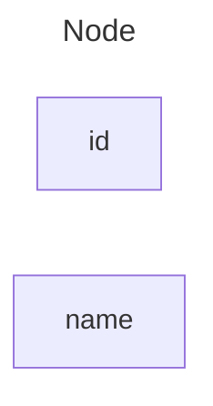


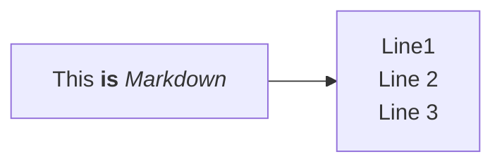

## Node(default)

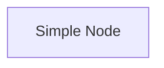

## Nod's shape 
A node with round edges
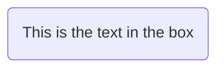

A stadium-shaped node


A node in a subroutine shape
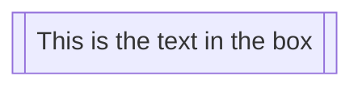

A node in a cylindrical shape
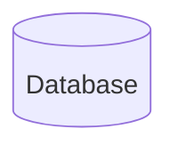

A node in the form of a circle
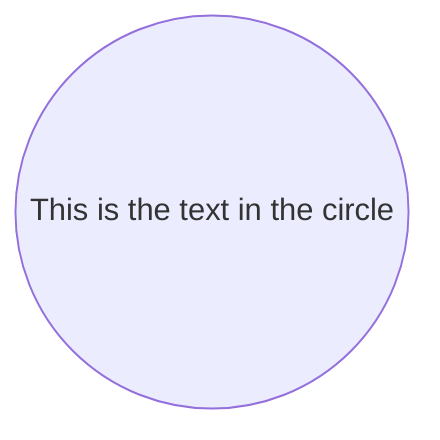

A node in an asymmetric shape
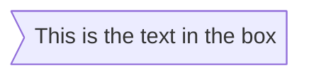

A node (rhombus)
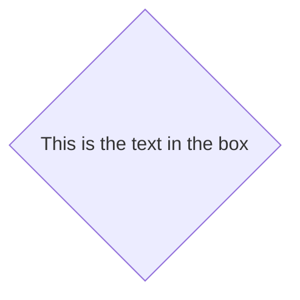

A hexagon node


Parallelogram
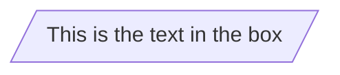

Parallelogram alt
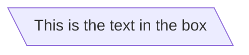

Trapezoid
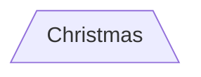

Trapezoid alt
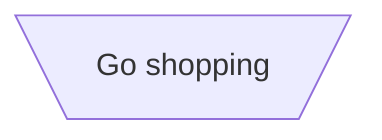

Double circle
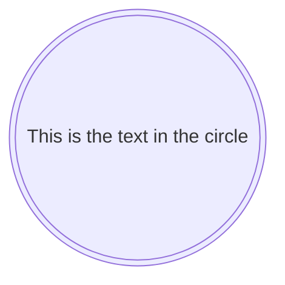

Expanded Node Shapes in Mermaid Flowcharts (v11.3.0+)
Mermaid introduces 30 new shapes to enhance the flexibility and precision of flowchart creation. These new shapes provide more options to represent processes, decisions, events, data storage visually, and other elements within your flowcharts, improving clarity and semantic meaning.

New Syntax for Shape Definition

Mermaid now supports a general syntax for defining shape types to accommodate the growing number of shapes. This syntax allows you to assign specific shapes to nodes using a clear and flexible format:


`A@{ shape: rect }`


## Links between nodes 
Arrow (-->)
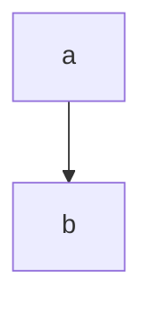
Open Link 
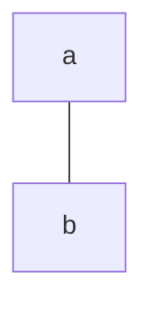

Text on links 
```mermaid
flowchart TB 
a -- This is  the text!--- b
```

```mermaid
flow chart LR
a ---|This is  the text|b
```

A link with arrow head and text
```mermaid
flowchart LR
a -->|text|b
```


```mermaid
flowchart LR 
a -- text -->b
```

Dotted Link 
```mermaid
flowchart LR
a -.-> b
```


Dotted link with text
```mermaid
flowchart LR
a -. text .->b
```


Thick link 
```mermaid

flowchart LR
A==>B
```


Thick link with text
```mermaid
flowchart LR
   A == text ==> B
```


```mermaid
---
title: Hello Title
config:
  theme: base
  themeVariables:
    primaryColor: "#00ff00"
---
flowchart
	Hello --> World
```


Complete List of New Shapes 


Below is a comprehensive list of the newly introduced shapes and their corresponding semantic meanings, short names, and aliases:

| Semantic Name        | Shape Name               | Short Name  | Description                         | Alias Supported                                       |
|----------------------|--------------------------|-------------|-------------------------------------|--------------------------------------------------------|
| Card                 | Notched Rectangle        | `notch-rect`  | Represents a card                   | card, notched-rectangle                                |
| Collate              | Hourglass                | `hourglass`   | Represents a collate operation      | collate, hourglass                                     |
| Com Link             | Lightning Bolt           | `bolt`        | Communication link                  | com-link, lightning-bolt                               |
| Comment              | Curly Brace              | `brace`       | Adds a comment                      | brace-l, comment                                       |
| Comment Right        | Curly Brace              | `brace-r`     | Adds a comment                      |                                                        |
| Comment with braces on both sides | Curly Braces| `braces`      | Adds a comment                      |                                                        |
| Data Input/Output    | Lean Right               | `lean-r`      | Represents input or output          | in-out, lean-right                                     |
| Data Input/Output    | Lean Left                | `lean-l`     | Represents output or input          | lean-left, out-in                                      |
| Database             | Cylinder                 | `cyl`         | Database storage                    | cylinder, database, db                                 |
| Decision             | Diamond                  | `diam`        | Decision-making step                | decision, diamond, question                            |
| Delay                | Half-Rounded Rectangle   | `delay`       | Represents a delay                  | half-rounded-rectangle                                 |
| Direct Access Storage| Horizontal Cylinder      | `h-cyl`       | Direct access storage               | das, horizontal-cylinder                               |
| Disk Storage         | Lined Cylinder           | `lin-cyl`     | Disk storage                        | disk, lined-cylinder                                   |
| Display              | Curved Trapezoid         | `curv-trap`   | Represents a display                | curved-trapezoid, display                              |
| Divided Process      | Divided Rectangle        | `div-rect`    | Divided process shape               | div-proc, divided-process, divided-rectangle           |
| Document             | Document                 | `doc`         | Represents a document               | doc, document                                          |
| Event                | Rounded Rectangle        | `rounded`     | Represents an event                 | event                                                  |
| Extract              | Triangle                 | `tri`         | Extraction process                  | extract, triangle                                      |
| Fork/Join            | Filled Rectangle         | `fork`       | Fork or join in process flow        | join                                                   |
| Internal Storage     | Window Pane              | `win-pane`    | Internal storage                    | internal-storage, window-pane                          |
| Junction             | Filled Circle            | `f-circ`      | Junction point                      | filled-circle, junction                                |
| Lined Document       | Lined Document           | `lin-doc`     | Lined document                      | lined-document                                         |
| Lined/Shaded Process | Lined Rectangle          | `lin-rect`    | Lined process shape                 | lin-proc, lined-process, lined-rectangle, shaded-process |
| Loop Limit           | Trapezoidal Pentagon     | `notch-pent`  | Loop limit step                     | loop-limit, notched-pentagon                           |
| Manual File          | Flipped Triangle         | `flip-tri`    | Manual file operation               | flipped-triangle, manual-file                          |
| Manual Input         | Sloped Rectangle         | `sl-rect`     | Manual input step                   | manual-input, sloped-rectangle                         |
| Manual Operation     | Trapezoid Base Top       | `trap-t`      | Represents a manual task            | inv-trapezoid, manual, trapezoid-top                   |
| Multi-Document       | Stacked Document         | `docs`        | Multiple documents                  | documents, st-doc, stacked-document                    |
| Multi-Process        | Stacked Rectangle        | `st-rect`     | Multiple processes                  | processes, procs, stacked-rectangle                    |
| Odd                  | Odd                      | `odd`         | Odd shape                           |                                                        |
| Paper Tape           | Flag                     | `flag`        | Paper tape                          | paper-tape                                             |
| Prepare Conditional  | Hexagon                  | `hex`         | Preparation or condition step       | hexagon, prepare                                       |
| Priority Action      | Trapezoid Base Bottom    | `trap-b`      | Priority action                     | priority, trapezoid, trapezoid-bottom                  |
| Process              | Rectangle                | `rect`        | Standard process shape              | proc, process, rectangle                               |
| Start                | Circle                   | `circle`      | Starting point                      | circ                                                   |
| Start                | Small Circle             | `sm-circ`     | Small starting point                | small-circle, start                                    |
| Stop                 | Double Circle            | `dbl-circ`    | Represents a stop point             | double-circle                                          |
| Stop                 | Framed Circle            | `fr-circ`     | Stop point                          | framed-circle, stop                                    |
| Stored Data          | Bow Tie Rectangle        | `bow-rect`    | Stored data                         | bow-tie-rectangle, stored-data                         |
| Subprocess           | Framed Rectangle         | `fr-rect`     | Subprocess                          | framed-rectangle, subproc, subprocess, subroutine      |
| Summary              | Crossed Circle           | `cross-circ`  | Summary                             | crossed-circle, summary                                |
| Tagged Document      | Tagged Document          | `tag-doc`     | Tagged document                     | tag-doc, tagged-document                               |
| Tagged Process       | Tagged Rectangle         | `tag-rect`    | Tagged process                      | tag-proc, tagged-process, tagged-rectangle             |
| Terminal Point       | Stadium                  | `stadium`     | Terminal point                      | pill, terminal                                         |
| Text Block           | Text Block               | `text`        | Text block                          |                                                        |

```mermaid
flowchart RL
  A@{shape: "notch-rect", label: "Card"}
  B@{shape: "hourglass", label: "Collate"}
  C@{shape: "bolt", label: "Com Link"}
  D@{shape: "brace", label: "Comment"}
  E@{shape: "brace-r", label: "Comment Right"}
  F@{shape: "braces", label: "Double Braces Comment"}
  G@{shape: "lean-r", label: "Input/Output"}
  H@{shape: "lean-l", label: "Output/Input"}
  I@{shape: "cyl", label: "Database"}
  J@{shape: "diam", label: "Decision"}
  K@{shape: "delay", label: "Delay"}
  L@{shape: "h-cyl", label: "Direct Access Storage"}
  M@{shape: "lin-cyl", label: "Disk Storage"}
  N@{shape: "curv-trap", label: "Display"}
  O@{shape: "div-rect", label: "Divided Process"}
  P@{shape: "doc", label: "Document"}
  Q@{shape: "rounded", label: "Event"}
  R@{shape: "tri", label: "Extract"}
  S@{shape: "fork", label: "Fork/Join"}
  T@{shape: "win-pane", label: "Internal Storage"}
  U@{shape: "f-circ", label: "Junction"}
  V@{shape: "lin-doc", label: "Lined Document"}
  W@{shape: "lin-rect", label: "Lined Process"}
  X@{shape: "notch-pent", label: "Loop Limit"}
  Y@{shape: "flip-tri", label: "Manual File"}
  Z@{shape: "sl-rect", label: "Manual Input"}
  A27@{shape: "trap-t", label: "Manual Operation"}
  A28@{shape: "docs", label: "Multi-Document"}
  A29@{shape: "st-rect", label: "Multi-Process"}
  A30@{shape: "odd", label: "Odd Shape"}
  A31@{shape: "flag", label: "Paper Tape"}
  A32@{shape: "hex", label: "Prepare"}
  A33@{shape: "trap-b", label: "Priority Action"}
  A34@{shape: "rect", label: "Process"}
  A35@{shape: "circle", label: "Start"}
  A36@{shape: "sm-circ", label: "Small Start"}
  A37@{shape: "dbl-circ", label: "Stop"}
  A38@{shape: "fr-circ", label: "Framed Stop"}
  A39@{shape: "bow-rect", label: "Stored Data"}
  A40@{shape: "fr-rect", label: "Subprocess"}
  A41@{shape: "cross-circ", label: "Summary"}
  A42@{shape: "tag-doc", label: "Tagged Document"}
  A43@{shape: "tag-rect", label: "Tagged Process"}
  A44@{shape: "stadium", label: "Terminal"}
  A45@{shape: "text", label: "Text Block"}

```


## Special Shapes in Mermaid Flowcharts (v11.3.0+)
Mermaid also introduces 2 special shapes to enhance your flowcharts: `icon` and `image`. These shapes allow you to include icons and images directly within your flowcharts, providing more visual context and clarity.

### Icon Shape 
You can use the icon shape to include an icon in your flowchart. To use icons, you need to register the `icon pack` first. Follow the instructions to [add custom icons](https://mermaid.js.org/config/icons.html). The syntax for defining an icon shape is as follows:


```mermaid
flowchart TD
    A@{ icon: "streamline-emojis:ant", form: "circle", label: "User Icon", pos: "t", h: 60 }

```

```mermaid 
flowchart TD
    A@{ img: "https://api.iconify.design/material-symbols:10k.svg", label: "Image Label", pos: "t", w: 100, h: 100, constraint: "off" }
```


## Links between nodes 

## Turning on Animation On 
```mermaid
graph LR 
A e1@==> B
e1@{animate: true}
```

```mermaid
graph LR 
A e1@==> B
e1@{animate: fast}
```

## Using classDef Statements for Animations 
```mermaid 
flowchart LR
  A e1@--> B
  classDef animate stroke-dasharray: 9,5,stroke-dashoffset: 900,animation: dash 25s linear infinite;
  class e1 animate
```