## Intro into Mermaid :mermaid:

To render Mermaid in Vs Code we need to install an exptansion for it.  I use Markdown prewien. jist find it in extension bar in yur vs code 

Good 
Now weee nedd documetantation 
here is the page with fdocumentations, tutorials, examples etc 
[Mermaid :mermaid:](https://mermaid.js.org/syntax/flowchart.html)

Step 1
Build a node 
```markdown 

```mermaid 
title: Node 
flowchart LR
id 
```
```

Output 

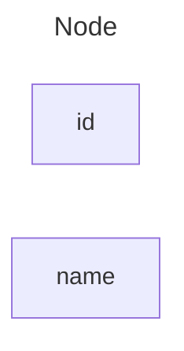


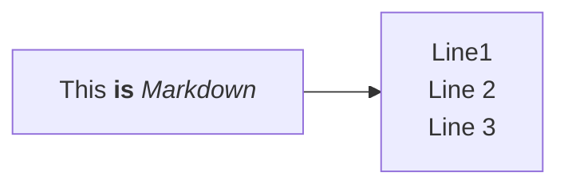

## Node(default)

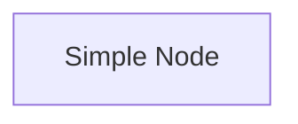

## Nod's shape 
A node with round edges
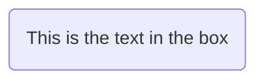

A stadium-shaped node
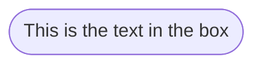

A node in a subroutine shape
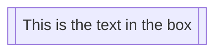

A node in a cylindrical shape
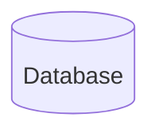

A node in the form of a circle
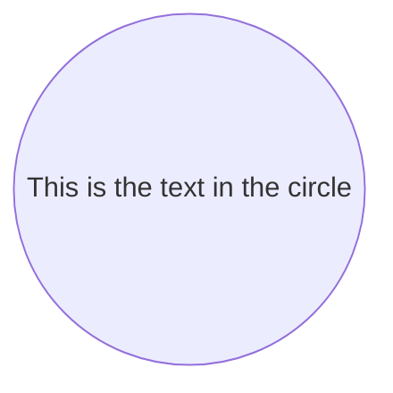

A node in an asymmetric shape


A node (rhombus)
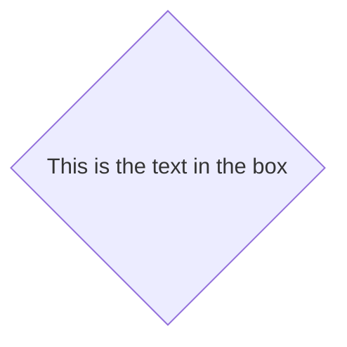

A hexagon node
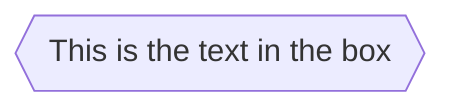

Parallelogram
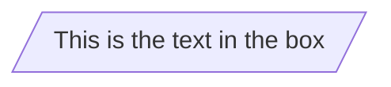

Parallelogram alt
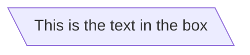

Trapezoid
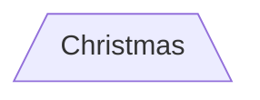

Trapezoid alt
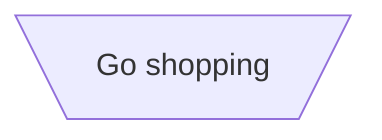

Double circle
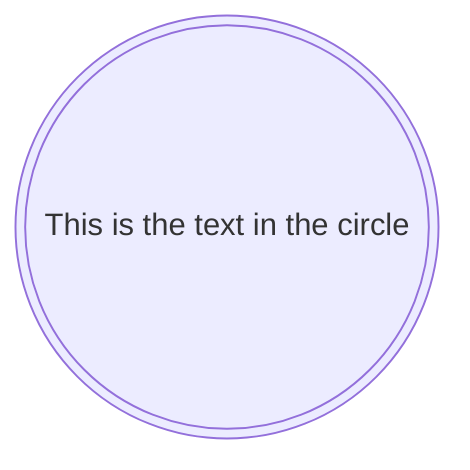

Expanded Node Shapes in Mermaid Flowcharts (v11.3.0+)
Mermaid introduces 30 new shapes to enhance the flexibility and precision of flowchart creation. These new shapes provide more options to represent processes, decisions, events, data storage visually, and other elements within your flowcharts, improving clarity and semantic meaning.

New Syntax for Shape Definition

Mermaid now supports a general syntax for defining shape types to accommodate the growing number of shapes. This syntax allows you to assign specific shapes to nodes using a clear and flexible format:


`A@{ shape: rect }`


## Links between nodes 
Arrow (-->)
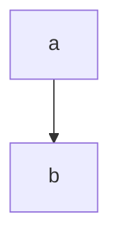
Open Link 
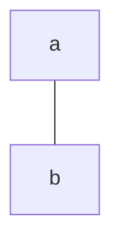

Text on links 
```mermaid
flowchart TB 
a -- This is  the text!--- b
```

```mermaid
flow chart LR
a ---|This is  the text|b
```

A link with arrow head and text
```mermaid
flowchart LR
a -->|text|b
```


```mermaid
flowchart LR 
a -- text -->b
```

Dotted Link 
```mermaid
flowchart LR
a -.-> b
```


Dotted link with text
```mermaid
flowchart LR
a -. text .->b
```


Thick link 
```mermaid

flowchart LR
A==>B
```


Thick link with text
```mermaid
flowchart LR
   A == text ==> B
```


```mermaid
```


```mermaid
```


```mermaid
```


